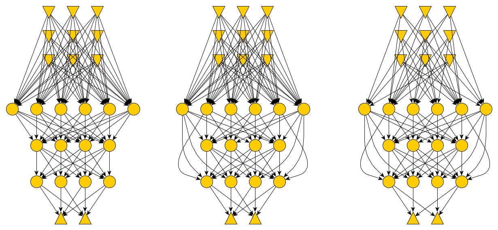

# pypaddle - tools for neural network graph topology analysis   [](https://GitHub.com/Naereen/StrapDown.js/graphs/commit-activity) [](https://www.python.org/downloads/release/python-360/) [](https://www.python.org/downloads/release/python-370/) [](https://www.python.org/downloads/release/python-380/)
**pypaddle** is a working title for tools for experimenting with sparse structures of artificial neural networks.
It fuses graph theory / network science and artificial neural networks.

## Installation
Via *conda* in your *environment.yml* (recommended for reproducible experiments):
```yaml
name: exp01
channels:
- defaults
dependencies:
- pip>=20
- pip:
    - pypaddle>=0.4
```

Via *poetry* (**recommended** for projects) using PyPi:
``poetry add pypaddle``

Directly with *pip* from PyPi:
```bash
pip install pypaddle
```

From public GitHub:
```bash
pip install --upgrade git+ssh://git@github.com:innvariant/pypaddle.git
```

## Sparse Neural Network implementations


There is various evidence across empirical machine learning studies that the way artificial neural networks are structurally connected has a (minor?) influence on performance metrics such as the accuracy or probably even on more complex concepts such as adversarial robustness.
What do we mean by "structure"?
We define structure over graph theoretic properties given a computational graph with very restricted non-linearities.
This includes all major neural network definitions and lets us study them from the perspective of their *representation* and their *structure*.
In a probabilistic sense, one can interprete structure as a prior to the model and despite single-layered wide networks are universal function approximators we follow the hypothesis that given certain structural priors we can find models with better properties.

**What's contained in pypaddle?**
- ready-to-use models in pytorch for learning instances on common (supervised/unsupervised) datasets from which a structural analysis is possible
- model-to-graph transformations for studying models from a graph-theoretic perspective

Before considering implementations, one should have a look on possible representations of Sparse Neural Networks.
In case of feed-forward neural networks (FFNs) the network can be represented as a list of weight matrices.
Each weight matrix represents the connections from one layer to the next.
Having a network without some connections then simply means setting entries in those matrices to zero.
Removing a particular neuron means setting all entries representing its incoming connections to zero.

However, sparsity can be employed on various levels of a general artificial neural network.
Zero order sparsity would remove single weights (representing connections) from the network.
First order sparsity removes groups of weights within one dimension of a matrix from the network.
Sparsity can be employed on connection-, weight-, block-, channel-, cell-level and so on.
Implementations respecting the areas for sparsification can have drastical differences.
Thus there are various ways for implementing Sparse Neural Networks.

### Feed-forward Neural Network with sparsity
The simplest implementation is probably one which provides multiple layers with binary masks for each weight matrix.
It doesn't consider any skip-layer connections.
Each layer is then connected to only the following one.
```python
import pypaddle.sparse

mnist_model = pypaddle.sparse.MaskedDeepFFN((1, 28, 28), 10, [100, 100])
```


```python
import pypaddle.sparse

structure  = pypaddle.sparse.CachedLayeredGraph()
# .. add nodes & edges to the networkx graph structure

# Build a neural network classifier with 784 input and 10 output neurons and the given structure
model = pypaddle.sparse.MaskedDeepDAN(784, 10, structure)
model.apply_mask()  # Apply the mask on the weights (hard, not undoable)
model.recompute_mask()  # Use weight magnitude to recompute the mask from the network
pruned_structure = model.generate_structure()  # Get the structure -- a networkx graph -- based on the current mask

new_model = pypaddle.sparse.MaskedDeepDAN(784, 10, pruned_structure)
```
```python
import pypaddle.sparse

model = pypaddle.sparse.MaskedDeepFFN(784, 10, [100, 100])
# .. train model
model.generate_structure()  # a networkx graph
```
