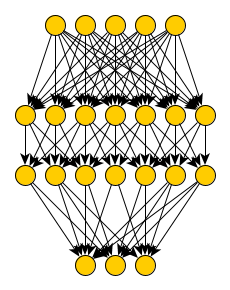
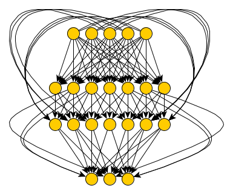
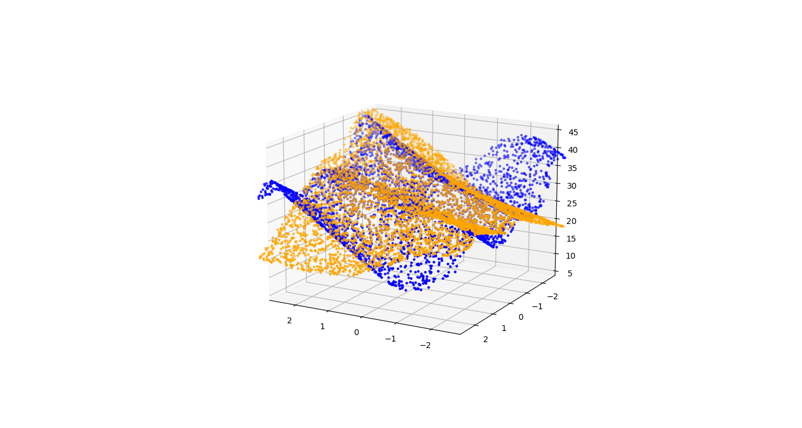

# deepstruct - tools for neural network graph topology analysis [](https://badge.fury.io/py/deepstruct)  [](https://deepstruct.readthedocs.io/en/latest/?badge=latest) [](https://www.python.org/downloads/release/python-360/) [](https://www.python.org/downloads/release/python-370/) [](https://www.python.org/downloads/release/python-380/)
Tools for fusing machine learning and graph theory.
We are fascinated with the interplay of end-to-end learnable, locally restricted models and their graph theoretical properties.
Searching for evidence of the structural prior hypothesis.
Interested in pruning, neural architecture search or learning theory in general?

See examples below or [read the docs](https://deepstruct.readthedocs.io).


## Installation
Via *poetry* (**recommended** for projects) using PyPi:
``poetry add deepstruct``

Directly with *pip* from PyPi:
```bash
pip install deepstruct
```

Via *conda* in your *environment.yml* (recommended for reproducible experiments):
```yaml
name: exp01
channels:
- defaults
dependencies:
- pip>=20
- pip:
    - deepstruct
```

From public GitHub:
```bash
pip install --upgrade git+ssh://git@github.com:innvariant/deepstruct.git
```

## Models
- *deepstruct.sparse.MaskableModule*: pytorch modules that contain explicit masks to enforce (mostly zero-ordered) structure
- *deepstruct.sparse.MaskedLinearLayer*: pytorch module with a simple linear layer extended with masking capability.
Suitable if you want to have linear-layers on which to enforce masks which could be obtained through pruning, regularization or other other search techniques.
- *deepstruct.sparse.MaskedDeepFFN*: feed-forward neural network with any width and depth and easy-to-use masks.
Suitable for simple and canonical pruning research on zero-ordered structure
- *deepstruct.sparse.MaskedDeepDAN*: feed-forward neural network with skip-layer connections based on any directed acyclic network.
Suitable for arbitrary structures on zero-order and on that level most flexible but also computationally expensive.
- *deepstruct.sparse.DeepCellDAN*: complex module based on a directed acyclic network and custom cells on third-order structures.
Suitable for large-scale neural architecture search
- *deepstruct.recurrent.MaskedDeepRNN*: multi-layered network with recurrent layers which can be masked

## What is the orders of structure?
- zero-th order: weight-level
- first order: kernel-level (filter, channel, blocks, cells)
- second order: layers

There is various evidence across empirical machine learning studies that the way artificial neural networks are structurally connected has a (minor?) influence on performance metrics such as the accuracy or probably even on more complex concepts such as adversarial robustness.
What do we mean by "structure"?
We define structure over graph theoretic properties given a computational graph with very restricted non-linearities.
This includes all major neural network definitions and lets us study them from the perspective of their *representation* and their *structure*.
In a probabilistic sense, one can interprete structure as a prior to the model and despite single-layered wide networks are universal function approximators we follow the hypothesis that given certain structural priors we can find models with better properties.


## Sparse Neural Network implementations




**What's contained in deepstruct?**
- ready-to-use models in pytorch for learning instances on common (supervised/unsupervised) datasets from which a structural analysis is possible
- model-to-graph transformations for studying models from a graph-theoretic perspective

Before considering implementations, one should have a look on possible representations of Sparse Neural Networks.
In case of feed-forward neural networks (FFNs) the network can be represented as a list of weight matrices.
Each weight matrix represents the connections from one layer to the next.
Having a network without some connections then simply means setting entries in those matrices to zero.
Removing a particular neuron means setting all entries representing its incoming connections to zero.

However, sparsity can be employed on various levels of a general artificial neural network.
Zero order sparsity would remove single weights (representing connections) from the network.
First order sparsity removes groups of weights within one dimension of a matrix from the network.
Sparsity can be employed on connection-, weight-, block-, channel-, cell-level and so on.
Implementations respecting the areas for sparsification can have drastical differences.
Thus there are various ways for implementing Sparse Neural Networks.

### Feed-forward Neural Network with sparsity
The simplest implementation is probably one which provides multiple layers with binary masks for each weight matrix.
It doesn't consider any skip-layer connections.
Each layer is then connected to only the following one.
```python
import deepstruct.sparse

mnist_model = deepstruct.sparse.MaskedDeepFFN((1, 28, 28), 10, [100, 100])
```


```python
import deepstruct.sparse

structure  = deepstruct.sparse.CachedLayeredGraph()
# .. add nodes & edges to the networkx graph structure

# Build a neural network classifier with 784 input and 10 output neurons and the given structure
model = deepstruct.sparse.MaskedDeepDAN(784, 10, structure)
model.apply_mask()  # Apply the mask on the weights (hard, not undoable)
model.recompute_mask()  # Use weight magnitude to recompute the mask from the network
pruned_structure = model.generate_structure()  # Get the structure -- a networkx graph -- based on the current mask

new_model = deepstruct.sparse.MaskedDeepDAN(784, 10, pruned_structure)
```
```python
import deepstruct.sparse

model = deepstruct.sparse.MaskedDeepFFN(784, 10, [100, 100])
# .. train model
model.generate_structure()  # a networkx graph
```


### Recurrent Neural Networks with sparsity
```python
import torch
import deepstruct.recurrent
import numpy as np

# A sequence of size 15 with one-dimensional elements which could e.g. be labelled
# BatchSize x [(1,), (2,), (3,), (4,), (5,), (0,), (0,), (0,)] --> [ label1, label2, ..]
batch_size = 100
seq_size = 15
input_size = 1
model = deepstruct.recurrent.MaskedDeepRNN(
    input_size,
    hidden_layers=[100, 100, 1],
    batch_first=True,
    build_recurrent_layer=deepstruct.recurrent.MaskedLSTMLayer,
)
random_input = torch.tensor(
    np.random.random((batch_size, seq_size, input_size)),
    dtype=torch.float32,
    requires_grad=False,
)
model.forward(random_input)
```


# Artificial PyTorch Datasets

We provide some simple utilities for supporting the quite fascinating area of artificial function approximation.
Like polynomials, neural networks are universal function approximators on bounded intervals of compact spaces.
To test, you can easily define a function of any finite dimension:
```python
import numpy as np
import torch.utils.data
from deepstruct.dataset import FuncDataset

# Our artificial landscape: f: R^2 -> R
# Have a look at https://github.com/innvariant/eddy for some visual examples
# You could easily define arbitrary functions from R^a to R^b
stier2020B1d = lambda x, y: 20 + x - 1.8*(y-5) + 3 * np.sin(x + 2 * y) * y + (x / 4) ** 4 + (y / 4) ** 4
ds_input_shape = (2,)  # specify the number of input dimensions (usually a one-sized tensor if no further structures are used)
# Explicitly define the target function for the dataset which returns a numpy array of our above function
# By above definition x is two-dimensional, so you have access to x[0] and x[1]
fn_target = lambda x: np.array([stier2020B1d(x[0], x[1])])
# Define a sampling strategy for the dataset, e.g. uniform sampling the space
fn_sampler = lambda: np.random.uniform(-2, 2, size=ds_input_shape)
# Define the dataset given the target function and your sampling strategy
# This simply wraps your function into a pytorch dataset and provides you with discrete observations
# Your model will later only know those observations to come up with an approximate solution of your target
ds_train = FuncDataset(fn_target, shape_input=ds_input_shape, size=500)

# Calculate the output shape given our target function .. usually simply a (1,)-dimensional output
ds_output_shape = fn_target(fn_sampler()).shape

# As usual in pytorch, you can simply wrap your dataset with a loading strategy ..
# This ensures e.g. that you do not iterate over your observations in the exact same manner
# In case you sample first 100 examples of a binary classification dataset with label 1 and then another
# 100 with label 2 it might impact your training .. so this ensures you have an e.g. random sampling strategy over the dataset
batch_size = 100
train_sampler = torch.utils.data.SubsetRandomSampler(np.arange(len(ds_train), dtype=np.int64))
train_loader = torch.utils.data.DataLoader(ds_train, batch_size=batch_size, sampler=train_sampler, num_workers=2)

# Iterate over your training set
for feat, target in train_loader:
    print(feat, target)
```
