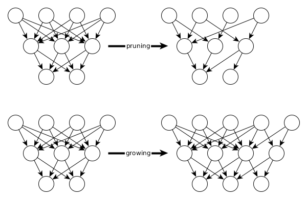

# deepstruct
Documentation for [deepstruct on github](https://github.com/innvariant/deepstruct).

### Notes
- **2023-01-18** mentioned some additional functionality such as learnable weights for a mask
- **2022-07-05** some pruning functionality was re-activated; good examples can also be found in the testing directory
- **2022-05-05** added some simple examples as currently used in experiments
- **2020-11-22** currently documenting the package


## Introduction
Deepstruct provides tools and models in pytorch to easily work with all kinds of sparsity of neural networks.
The four major approaches in that context are 1) **pruning** neural networks, 2) defining **prior structures** on neural networks, 3) **growing** neural network structures and 4) conducting graph-neural-network **round-trips**.



## Sparse Feed-forward Neural Net for MNIST
One-line construction suffices to build a neural network with any number of hidden layers and then prune it in a second step.
The models in *deepstruct* provide an additional property *model.mask* on which a sparsity pattern can be defined per layer.
Pruning boils down to defining zeros in this binary mask.
```python
import deepstruct.sparse
from deepstruct.pruning import PruningStrategy, prune_network_by_saliency

input_size = 784
output_size = 10
model = deepstruct.sparse.MaskedDeepFFN(input_size, output_size, [200, 100])

# Prune 10% of the model based on its absolute weights
prune_network_by_saliency(model, 10, strategy=PruningStrategy.PERCENTAGE)
```

# Base Layer *MaskedLinearLayer*
The underlying base module for *deepstruct* is a *MaskedLinearLayer* which has a *mask*-property.
Example:
```python
import torch
from deepstruct.sparse import MaskedLinearLayer

layer = MaskedLinearLayer(784, 100)
layer.mask = torch.zeros(100, 784)  # zeros out all connections
layer.mask = torch.ones(100, 784)  # activate all connections between input and output
```

## Learnable mask weights for differentiable sparsity
Upon initialization this can be set to be learnable:
```python
from deepstruct.sparse import MaskedLinearLayer
MaskedLinearLayer(784, 100, mask_as_params=True)
```
In that case of setting the mask as a learnable parameters, the underlying data structure is of shape $(out_features, in_feature, 2)$ instead of a commonly used binary matrix (out_features, in_feature).
This means that for each connectivity weight in a layer you can learn kind of "log-probabilities" $p_1$ and $p_2$ which are passed through a softmax such that they are interpreted as probabilities for how likely it is that the connection is active or not.
In an inferencing step these probabilities are then hardened by an argmax operation such that the connection will be either on or off (similar to differentiable learning of paths).
This can be interesting in differentiable structure learning settings.

## Creating Neural Nets from Graphs
```python
import deepstruct.sparse

input_size = 5
output_size = 2
structure  = deepstruct.sparse.CachedLayeredGraph()
structure.add_nodes_from(range(20))
model = deepstruct.sparse.MaskedDeepDAN(input_size, output_size, structure)
```

## Binary Trees, Grids or Small-World Networks as Prior Structure of Neural Nets
Various graph generators can be easily used to build a sparse structure with various residual / skip connections based on a given networkx graph.
The data structure has to be converted into a layered graph form from which the topological sorting can be better used for the underlying implementation.
The model *MaskedDeepDAN* then provides a simple constructor to obtain a model from the given layered directed acyclic graph structure by specifying the input dimensions and the output dimensions of the underlying problem.
Training proceeds as with any other pytorch model.
```python
import networkx as nx
import deepstruct.sparse
import deepstruct.graph as dsg

# Create a graph with networkx
graph_btree = nx.balanced_tree(r=2, h=3)
graph_grid = nx.grid_2d_graph(3, 30, periodic=False)
graph_smallworld = nx.watts_strogatz_graph(100, 3, 0.8)

ds_graph_btree = dsg.LayeredGraph.load_from(graph_btree)
ds_graph_grid = dsg.LayeredGraph.load_from(graph_grid)
ds_graph_smallworld = dsg.LayeredGraph.load_from(graph_smallworld)

# Define a model based on the structure
input_shape = (5, 5)
output_size = 2
model = deepstruct.sparse.MaskedDeepDAN(input_shape, output_size, ds_graph_btree)
```


## Extract graphs from neural nets
As of *2022-05-05* this is currently only implemented on a zero-th order level of a neural network in which neurons correspond to graph vertices.
This is a very expensive transformation as for common models you will transform a model of several megabytes in efficient data storages from pytorch into a networkx graph of hundred thousands to millions of vertices.
We're working on defining other levels of sparsity and you're welcome to support us in it, e.g. write a mail to julian.stier@uni-passau.de !
```python
import torch
import deepstruct.transform as dtr

# Define a transformation object which takes a random input to pass through the model for duck-punching ("analysis")
input_shape = (5, 5)
model = None  # take the model e.g. from above
functor = dtr.GraphTransform(torch.randn((1,)+input_shape))

# Obtain the graph structure from the model as based on your transformation routine
graph = functor.transform(model)
print(graph.nodes)
```


# Training a deepstruct model with random BTrees
```python
import torch
import numpy as np
import networkx as nx
import deepstruct.sparse
import deepstruct.graph as dsg

device = torch.device("cuda:0" if torch.cuda.is_available() else "cpu")

# Arrange
batch_size = 10
input_size = 784
output_size = 10

graph_btree = nx.balanced_tree(r=2, h=3)
ds_graph_btree = dsg.LayeredGraph.load_from(graph_btree)
model = deepstruct.sparse.MaskedDeepDAN(input_size, output_size, ds_graph_btree)
model.to(device)

# Prepare training
optimizer = torch.optim.Adam(model.parameters())
criterion = torch.nn.CrossEntropyLoss()

# Here you could put your for-loop over a dataloader
for epoch_current in range(10):
    random_input = torch.tensor(
        np.random.random((batch_size, input_size)), device=device, requires_grad=False
    )
    random_target = torch.tensor(
        np.random.randint(0, 2, batch_size), device=device, requires_grad=False
    )

    optimizer.zero_grad()
    prediction = model(random_input)
    loss = criterion(prediction, random_target)
    loss.backward()
    optimizer.step()
```


## Available Models


## Artificial Datasets
